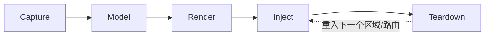

# 01 · 架构与模型

> 把原文档的"七层流水线"裁剪为**五层**，定义跨端共享的 `bones.json` schema v2 与目录约定，并给出 `ReadySignal` 抽象（拆除信号的唯一统一点）。
> 本文是所有 step 的"数据/接口契约"，所有 step 必须按此 schema 输入输出。

---

## 1. 五层流水线（七层裁剪后）

| 层 | 输入 | 输出 | 关键文档 |
|---|---|---|---|
| **Capture · 捕获** | 真实 DOM / fixture | `bones.json`（中间表示） | [02 BGv2](./02-最佳生成算法.md) + [16 DevSave](./16-step7-DevSave-与dev-ske.md) + [17 Playwright](./17-step8-Playwright批量与Visual-Diff.md) |
| **Model · 模型** | `bones.json` | 校验后的内存对象 | 本文 §3 |
| **Render · 渲染** | `bones.json` | HTML / RN 组件 / WXML | [10 snippet](./10-step1-snippet生成器.md) + [30 RN](./30-step11-RN-后端.md) + [31 Taro](./31-step12-Taro-小程序后端.md) |
| **Inject · 注入** | Render 产物 | 注入 `index.html` / 组件树 / WXML | [11 SSG-lite](./11-step2-vite-plugin-SSG-lite.md) + [13 SWC](./13-step4-SWC-runtime-inject.md) |
| **Teardown · 拆除** | `ReadySignal` 触发 | DOM remove / 区域揭示 | 本文 §5 |

被裁掉的两层（相对原 7 层）：

- ~~Schedule（调度）~~：暂不做 SkeletonScheduler；用 native `rIC` 替代（详见 [42](./42-Open-Questions-后置.md)）
- ~~Bridge（衔接）~~：原 Bridge 包含 SPA 路由切换 + 预加载 + 接口态复用，本方案把它拆进 `Inject`（SPA bridge 是 inject 的一部分）和 `Teardown`（区域揭示信号），不再单独成层



---

## 2. 包结构（与三端目录对齐）

新代码全部在 `packages/smarty/` 下（**不动**现有 `packages/boneyard/`）：

```
packages/smarty/
  package.json
  src/
    core/                      ← 跨端共享
      schema.ts                ← bones.json schema 定义 + 校验
      ready-signal.ts          ← ReadySignal 抽象（§5）
      style-cache.ts           ← BGv2 §11.2 styleCache
      rbush.ts                 ← BGv2 §10 块合并 R-tree
      hash.ts                  ← 内容 hash 工具
    generator/                 ← BGv2 实现（见 [02](./02-最佳生成算法.md)）
      bgv2.ts                  ← 入口 BGv2.generate()
      traverse.ts
      classify.ts
      prune-tree.ts
      shape.ts
      text-gradient.ts
      list.ts
      merge.ts
      cleanup-css.ts
      output.ts                ← JSON ⇄ bin ⇄ HTML
    web/                       ← Web Render + Inject
      snippet.ts               ← renderSnippet()（[10](./10-step1-snippet生成器.md)）
      vite-plugin.ts           ← SSG-lite + DevSave + SWC（[11](./11-step2-vite-plugin-SSG-lite.md) + [16](./16-step7-DevSave-与dev-ske.md)）
      bridge.ts                ← SPA bridge（[12](./12-step3-SPA-router-bridge.md)）
      swc-plugin.ts            ← runtime inject（[13](./13-step4-SWC-runtime-inject.md)）
      bound.tsx                ← <Bound> 组件（[14](./14-step5-Bound显式接口态.md)）
      use-skeleton-gate.ts     ← delay/minDuration（[14](./14-step5-Bound显式接口态.md)）
    rn/                        ← React Native Render + Inject（[30](./30-step11-RN-后端.md)）
      Skeleton.tsx
      capture.ts               ← measure 等价采集
      reanimated-shimmer.ts
    mp/                        ← Taro / 小程序（[31](./31-step12-Taro-小程序后端.md)）
      taro-plugin.ts           ← 编译期 WXML 注入
      mp-bone.tsx              ← <bone-skeleton /> 自定义组件
    cli/
      build.ts                 ← Playwright 批采 + Visual Diff（[17](./17-step8-Playwright批量与Visual-Diff.md)）
      check.ts                 ← 严格深层依赖（[18](./18-step9-check-CLI-深层依赖.md)）
      init-hooks.ts            ← pre-commit（[19](./19-step10-pre-commit-与-CI.md)）
      breakpoint-scan.ts       ← 断点扫描（[15](./15-step6-断点自动扫描.md)）
    config/
      schema.ts                ← smarty.config.json schema
      resolve.ts
  bin/
    skeleton-v2.js             ← CLI 入口
  test/
    fixtures/
    integration/
```

---

## 3. bones.json schema v2

### 3.1 顶层结构

```ts
export interface SkeletonDSL {
  kind: 'ssr' | 'api'                    // ssr=page 级；api=区域级
  platform: 'web' | 'rn' | 'mp'          // 平台标识
  version: 2                              // BGv2 schema 版本
  width: number                           // 采集时容器宽度（响应式基准）
  height: number                          // 采集时容器高度
  rootColor: string                       // 默认骨架色
  bones: Bone[]                           // 扁平 bone 数组，已经过 BGv2 优化
  css?: string                            // styleCache flush 出的 class 规则
  breakpoints?: Record<number, SkeletonDSL>   // 多断点：宽度 → 该断点的 DSL（嵌套，仅 web）
  region?: string                         // kind='api' 时填，区域 id
  deps?: string[]                         // kind='api' 时填，依赖的 dataKey 列表
  _meta: SkeletonMeta                     // 元信息（hash、源文件等）
}

export interface SkeletonMeta {
  hash: string                            // 内容 hash（不含 _meta 自身）
  sourceFile: string                      // 主源文件相对路径
  sourceDeps: string[]                    // 深度 5 内的全部依赖（排序）
  sourceHash: string                      // sha256(sourceFile + sourceDeps 内容拼接)
  outOfDepth?: string[]                   // 超过深度 5 的依赖，仅记不参与 hash
  breakpointSource?: {
    default: number[]
    scanned: number[]                     // 来自 CSS @media / Tailwind / runtime
    extended: number[]                    // 来自 boneyard.config 的 extend
  }
  visualDiff?: {                          // 来自 Playwright + pixelmatch
    passed: boolean
    maxPixelDiff: number                  // 百分比
    diffImage?: string                    // *.diff.png 相对路径，仅失败时填
  }
  builtAt: number                         // Unix ms
  capturedBy: 'devsave' | 'playwright' | 'extension'
}
```

### 3.2 Bone 元素

```ts
export type Bone =
  | RectBone
  | TextBone
  | ImageBone
  | CircleBone
  | ListBone
  | ControlBone

interface BoneBase {
  id: number
  x: number          // 百分比 0–100
  y: number          // 像素
  w: number          // 百分比 0–100
  h: number          // 像素
  r?: string         // border-radius，'50%' | '8px'
  color?: string     // 覆盖默认 rootColor
  layout?: {         // BGv2 §6 trinity 保留布局
    display: 'flex' | 'grid'
    flexDirection?: string
    justifyContent?: string
    alignItems?: string
    gap?: string
    gridTemplate?: string
  }
  className?: string // styleCache 命中的 class，与 inline 互斥
}

interface RectBone extends BoneBase { type: 'rect' }
interface CircleBone extends BoneBase { type: 'circle' }    // r='50%'，w/h 必相等

interface TextBone extends BoneBase {
  type: 'text'
  mode: 'gradient' | 'precise' | 'block'   // BGv2 §7
  lineHeight: number                        // px
  lines: number                             // gradient/block 模式估算行数
  lastLineWidth?: number                    // 末行宽度比 0–1，gradient 模式专用
}

interface ImageBone extends BoneBase {
  type: 'image' | 'image-bg'
  src?: string                              // 原始 src，调试用
  sampledColor?: string                     // BGv2 §8 构建期采样
}

interface ControlBone extends BoneBase {
  type: 'control'                           // INPUT / BUTTON / .btn 等
  controlHint?: 'button' | 'input' | 'tag'
}

interface ListBone extends BoneBase {
  type: 'list'
  count: number                             // 采集时项数（运行时可被 deps 数据覆盖）
  itemHeight: number
  itemBones: Bone[]                         // 首项子骨架
  axis: 'vertical' | 'horizontal'           // 默认 vertical
}
```

### 3.3 schema 校验

`packages/smarty/src/core/schema.ts` 用 `zod` 实现校验（运行时 + 编译期都用）：

```ts
import { z } from 'zod'

export const BoneSchema: z.ZodType<Bone> = z.lazy(() => z.discriminatedUnion('type', [
  RectBoneSchema, TextBoneSchema, ImageBoneSchema, CircleBoneSchema, ListBoneSchema, ControlBoneSchema,
]))

export const SkeletonDSLSchema = z.object({
  kind: z.enum(['ssr', 'api']),
  platform: z.enum(['web', 'rn', 'mp']),
  version: z.literal(2),
  // ...
})

export function validate(dsl: unknown): SkeletonDSL {
  const result = SkeletonDSLSchema.safeParse(dsl)
  if (!result.success) throw new SchemaError(result.error.format())
  return result.data
}
```

每个 `*.bones.json` 在写入前和读取后**都**走 `validate()`，保证脏数据不进流程。

---

## 4. 跨端目录约定（v2 调整：类型 × 平台二级结构）

### 4.1 项目根

```
<project-root>/
  smarty.config.json              ← 配置（[10 §模板变量](./10-step1-snippet生成器.md)）
  src/                            ← 业务源码（含 <Skeleton> / <Bound>）
  bones/                          ← Playwright 跑出的权威产物，进 git
    pages/                          ← page 级（原 ssr，业务术语命名）
      web/...
      rn/...
      mp/...
    regions/                        ← region 级（原 api，业务术语命名）
      web/...
      rn/...
      mp/...
  .smarty-cache/                  ← DevSave 预览缓存，不进 git
    pages/web/{name}.preview.bones.json
    regions/web/{region}.preview.bones.json
```

### 4.2 `bones/pages/`（page 级）

```
bones/pages/
  web/
    {route-name}.bones.json
    {route-name}.snippet.html
    {route-name}@375.fixture.png   ← Playwright 截图（仅 build 模式）
    {route-name}@375.skeleton.png
    {route-name}@375.diff.png      ← 仅 diff 超阈值时存在
    manifest.json                  ← 路由 → snippet 映射
  rn/
    {component-name}.bones.json    ← RN 无路由，按组件命名
  mp/
    {page-name}.bones.json
    pages/{page-name}.wxml.partial ← 编译期注入到对应页面 WXML
```

### 4.3 `bones/regions/`（region 级）

```
bones/regions/
  web/
    {region}.bones.json
    bindings.json                  ← region → deps 映射
  rn/
    {region}.bones.json
  mp/
    {region}.bones.json
```

### 4.4 `.smarty-cache/`（DevSave 预览，不进 git）

DevSave 写入此目录、`smarty check` **不读取**此目录（详见 [00 D4](./00-总览与决策锚点.md) 与 [16-step7](./16-step7-DevSave-与dev-ske.md)）。`.gitignore` 必加 `.smarty-cache/`。

---

## 5. Teardown · ReadySignal 抽象

拆除骨架的"什么时候开始拆"在不同平台/模式下完全不同，但**消费端的逻辑统一**。所以抽象一个 `ReadySignal` 接口：

```ts
// packages/smarty/src/core/ready-signal.ts
export interface ReadySignal {
  subscribe(onReady: () => void): () => void   // 返回 unsubscribe
}
```

### 5.1 各端 source 实现

| 场景 | 实现 | 文件 |
|---|---|---|
| Web SSR/SSG-lite 首屏 | `MutationObserver(root, {childList:true, subtree:true})` + 仅元素节点触发 + MAX_WAIT 兜底 | `web/bridge.ts`（[12-step3](./12-step3-SPA-router-bridge.md)） |
| Web 接口态 | `Promise.all(deps.map(adapterSubscribe))` | `web/bound.tsx`（[14-step5](./14-step5-Bound显式接口态.md)） |
| RN 首屏 | `InteractionManager.runAfterInteractions(() => dataReady.then(...))` | `rn/Skeleton.tsx`（[30](./30-step11-RN-后端.md)） |
| RN 接口态 | 同 Web 接口态 | 同上 |
| 小程序 | 页面 `setData({ loading: false })` 前调用 `mpDataSignal.fire()` | `mp/mp-bone.tsx`（[31](./31-step12-Taro-小程序后端.md)） |

### 5.2 消费端统一

```ts
// packages/smarty/src/core/teardown.ts
import type { ReadySignal } from './ready-signal'

export function attachTeardown(signal: ReadySignal, dismiss: () => void): () => void {
  let done = false
  const unsubscribe = signal.subscribe(() => {
    if (done) return
    done = true
    dismiss()
    unsubscribe()
  })
  return unsubscribe
}
```

**核心约束**（铁律一改写版）：`dismiss()` 内不允许做任何重活；只做 DOM remove / class add，动画/淡出走 CSS。任何复杂工作（埋点、解析下一跳）都用 `requestIdleCallback` 异步推后。

---

## 6. 配置文件 schema

`smarty.config.json`（[03 待整理 - 当前嵌入到本节]）：

```jsonc
{
  "$schema": "node_modules/smarty/dist/config.schema.json",

  "skeleton": {
    "outDir": { "pages": "bones/pages", "regions": "bones/regions" },
    "platforms": ["web", "rn", "mp"],
    "color": "#f0f0f0",
    "darkColor": "#222222",
    "darkSelector": ".dark",

    "breakpoints": {
      // v2 改：按平台分（三端经验值不同，详见各 step 文档）
      "web": { "default": [375, 768, 1280], "autoScan": true, "source": ["css","tailwind","runtime"], "extend": [], "min": 320, "max": 1920, "mergeGap": 24 },
      "rn":  { "default": [375, 414], "autoScan": false, "extend": [], "min": 320, "max": 768, "mergeGap": 16 },
      "mp":  { "default": [375, 414], "autoScan": false, "extend": [], "min": 320, "max": 768, "mergeGap": 16 }
    },

    "ssg": {
      "inject": "auto",                 // 'auto' | 'head' | 'body'
      "rootSelector": "#root",
      "maxWait": 5000
    },

    "api": {
      "delay": 120,
      "minDuration": 300,
      "list": { "maxItems": 8 }
    },

    "generator": {
      "ignore":  [],
      "remove":  [],
      "include": null,                  // 字符串形式的 (node, draw) => void
      "before":  null,                  // 字符串形式的 () => void
      "pruneTree": "safe",              // v2 新增：'aggressive' | 'safe' | 'off'，默认 safe
      "imageColorSample": false         // v2 改默认 false（实验性，详见 [02 §8.1](./02-最佳生成算法.md)）
    },

    "check": {
      "depth": 5,
      "ignoreGlobs": [
        "**/design-tokens.*",
        "**/icons/**",
        "**/node_modules/**",
        "**/*.svg",
        "**/*.css"
      ],
      "unboundAsError": false
    },

    "dev": { "mode": "ske", "endpoint": "/__smarty__/save" },

    "visualDiff": {
      "enabled": true,
      "threshold": 0.05,                // 5%
      "outputDir": "bones/pages/web"
    }
  }
}
```

---

## 7. 验收

- `packages/smarty/src/core/schema.ts` 通过 `zod` 校验所有 fixture 中的 `*.bones.json`
- `BoneSchema` discriminated union 覆盖 6 种 bone 类型，未声明的 type 校验失败
- 各端目录约定在 `dev:ske` 实测下能自动生成、文件路径正确
- `ReadySignal` 抽象的 5 个 source 实现各自单元测试通过
- 配置文件的所有字段都有 default 值，未配置时不报错
