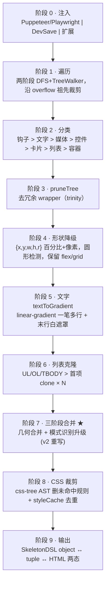

# 02 · 最佳骨架生成算法（11 项目融合精华）

> 本文是**算法核心**，所有 step（snippet 生成器 / Playwright 批采 / DevSave / RN / 小程序）都引用本算法。
> 算法名：**Boneyard Generator v2（简称 BGv2）**

---

## 0. 调研基础

并行调研了 11 个骨架屏开源项目（详见 [README §1 调研报告](./README.md)），按"算法步骤 × 项目"做了得分对比。最终算法 **逐步骤选最强**，并补 4 项各项目都没做的新机制（标 ★）。

| # | 调研的 11 个项目（按贡献排序） | 主要贡献 |
|---|---|---|
| 1 | `page-skeleton-webpack-plugin` | 两阶段遍历、css-tree 裁剪、styleCache 去重、`text.js` linear-gradient |
| 2 | `smarty-skeleton-toolchain`（trinity） | `textToGradient` 多行渐变、`pruneTree` 包装剪枝、布局保真、CLS 锚定 |
| 3 | `smarty-skeleton-toolchain`（core） | `getVisibleRect` overflow 祖先裁剪、`matchLeafClass` 控件识别、DSL 输出（bin 收益微小，v2 简化为 object/tuple） |
| 4 | `awesome-skeleton` | 最完整 `data-skeleton-*` 钩子体系、PNG 截图兜底 |
| 5 | `smarty-skeleton-v1` | 相邻 box 几何合并算法 |
| 6 | `create-skeleton-quickly` | `isCustomCardBlock` 卡片启发式、`includeElement` 回调 |
| 7 | `visual-skeleton-plugin` | `Range.getClientRects()` 逐行真实矩形 |
| 8 | `dps` | `includeElement(node, draw)` + `init()` 钩子、cheerio 注入 |
| 9 | `skeleton-chrome-extension` | LI + TR 列表识别、局部容器克隆 |
| 10 | `smarty-skeleton-v2` | Service Worker 预加载、`useSkeletonLoading` |
| 11 | `smarty-skeleton`（standalone） | TS 重写（**算法回退，不参考**） |

> 反面教材：`chrome-extension-skeleton` 与骨架无关（扩展脚手架）；`visual-skeleton-plugin` popup 有 bug；`smarty-skeleton` standalone 丢失了 v1 的块合并。

---

## 1. 算法总览（10 阶段流水线）



---

## 2. 阶段 0 · 注入（多入口 unified）

| 场景 | 入口 | 触发 |
|---|---|---|
| Web 构建期批采 | Playwright `addScriptTag(bgv2.js)` + `page.evaluate('BGv2.generate()')` | `smarty build` |
| Web 开发期 DevSave | Vite `transformIndexHtml` 注入 `bgv2.js` + `<Skeleton>` 挂载触发 | `dev:ske` |
| Web 调试浏览 | 浏览器扩展 manifest v3 注入 content script | 用户点扩展按钮 |
| 小程序 H5 预览 | Taro H5 模式同 Web | 同上 |
| RN | RN 内运行（无 BGv2，因为 RN 无 DOM）→ `measure()` 等价物 | RN 启动 |

`bgv2.js` 是 UMD bundle，对外只暴露：

```ts
window.BGv2 = {
  generate(opts: {
    root?: Element                       // 默认 document.body
    config?: BGv2Config                  // 优先级低于 data-skeleton-*
    onProgress?: (stage, payload) => void
  }): SkeletonDSL                        // 同步返回，不依赖网络
}
```

---

## 3. 阶段 1 · 遍历（两阶段混合）

### 3.1 第一阶段 · 收集候选

复用 page-skeleton 的"先收集后处理"模式（[`script/main.js:45-105`](file:///Users/didi/Documents/smart/page-skeleton-webpack-plugin-master/src/script/main.js)），关键改进：

- **DFS 入栈**，避免 BFS 队列在深树时内存爆炸
- **TreeWalker 单独走文本节点**（visual 的最强点，[`content.js:32-64`](file:///Users/didi/Documents/code/visual-skeleton-plugin/content.js)）：用 `NodeFilter.SHOW_TEXT` 一次性拿全部非空 text
- **过滤器五条**（全部不通过才入候选）：

```ts
function shouldVisit(el: Element, parentClipRect: Rect): boolean {
  if (el.hasAttribute('data-skeleton-remove')) return false       // awesome 钩子
  if (!isInViewPort(el)) return false                       // page-skeleton
  const cs = getComputedStyle(el)
  if (cs.display === 'none' || cs.visibility === 'hidden') return false
  const rect = getVisibleRect(el, parentClipRect)           // toolchain 关键改进
  if (rect.width < 5 || rect.height < 5) return false       // smarty-v1 minW/minH
  return true
}
```

`getVisibleRect` 来自 [`toolchain/core/generateSkeleton.ts:38-64`](file:///Users/didi/Documents/code/smarty-skeleton-toolchain/packages/core/src/generate/generateSkeleton.ts)：**沿 `overflow:hidden/scroll/auto` 祖先链做矩形交集**，让被父容器裁剪的元素只保留可见部分。这是 11 个项目里仅 toolchain 有的关键能力。

### 3.2 第二阶段 · 批处理

收集完候选数组后再处理，**而不是边走边处理**。好处：

- 可以做"全局优化"（块合并、CSS 裁剪、styleCache）
- 可以排序后稳定输出（hash 一致 → CI 友好）
- 错误隔离：单个 bone 解析失败不中断整树

---

## 4. 阶段 2 · 元素分类（决策树）

合并 awesome（钩子优先）+ page-skeleton（computedStyle）+ create（卡片启发）+ toolchain（控件关键字）的最优分类规则：

```ts
function classify(el: Element): BoneType {
  if (el.hasAttribute('data-skeleton-block')) return 'leaf-rect'           // awesome 钩子最高优先
  if (el.hasAttribute('data-skeleton-shape')) return el.getAttribute('data-skeleton-shape')! as BoneType
  if (isTextLeaf(el)) return 'text'                                  // 单文本子节点 or TEXT_NODE
  if (MEDIA_TAGS.has(el.tagName)) return isCircle(el) ? 'circle' : 'image'
  if (hasUrlBackgroundImage(el)) return 'image-bg'                   // page-skeleton EXT_REG
  if (isControl(el)) return 'control'                                // toolchain matchLeafClass
  if (isCustomCardBlock(el)) return 'card'                           // create-skeleton-quickly 启发
  if (LIST_TAGS.has(el.tagName)) return 'list'                       // page-skeleton + chrome-ext 含 TR
  return 'container'                                                 // 继续递归
}

const MEDIA_TAGS = new Set(['IMG','SVG','VIDEO','CANVAS','IFRAME','PICTURE'])
const LIST_TAGS  = new Set(['UL','OL','TBODY'])

const CONTROL_KEYWORDS = /\b(btn|button|input|tag|chip|badge|pill|action)\b/i
function isControl(el: Element): boolean {
  if (['INPUT','BUTTON','TEXTAREA','SELECT'].includes(el.tagName)) return true
  return CONTROL_KEYWORDS.test(el.className)                         // toolchain :243-281
}

function isCustomCardBlock(el: Element): boolean {                   // create :83-93
  const cs = getComputedStyle(el)
  const hasBg = cs.backgroundColor !== 'rgba(0, 0, 0, 0)' && cs.backgroundColor !== 'transparent'
  const hasBorder = parseFloat(cs.borderWidth) > 0
  const hasShadow = cs.boxShadow !== 'none'
  const rect = el.getBoundingClientRect()
  return (hasBg || hasBorder || hasShadow) && rect.width >= 80 && rect.height >= 40
}
```

**决策树顺序很关键**（钩子 → 文字 → 媒体 → 控件 → 卡片 → 列表 → 容器）：钩子永远最高优先；文字优先于其它启发式以正确触发 textToGradient；卡片在列表前以避免列表项里被错认成卡片。

---

## 5. 阶段 3 · pruneTree（v2 保守化：三档可配 + 保留条件清单）

trinity 的 [`SkeletonTranspiler.pruneTree`](file:///Users/didi/Documents/smart/smarty-skeleton-toolchain/trinity-chrome-extension/src/lib/SkeletonTranspiler.ts) 原版剪 30–60% wrapper，**但激进剪枝会误伤**：

- 业务 `querySelector` / `getElementById` 依赖的结构锚点
- `role` / `aria-*` 语义节点（可访问性）
- `data-testid` / `data-*` 测试钩子
- 设计系统占位 layer（tailwind `@layer`、Storybook 包装）
- `position: relative` 父定位锚点
- **Visual Diff 准度**：剪掉的层让骨架与真实 DOM 不再 1:1，[17-step8 pixelmatch](./17-step8-Playwright批量与Visual-Diff.md) 容易超阈值

v2 修订为**三档可配 + 完整保留条件清单**：

### 5.1 三档模式

| 模式 | 剪掉比例 | 风险 | 适用 |
|---|---|---|---|
| `aggressive` | ~60% | Visual Diff 容易超阈值 | 极端追求体积、放宽 diff 阈值的项目 |
| `safe`（**v2 默认**） | ~30–40% | 与真实 DOM 1:1，diff 友好 | 推荐 |
| `off` | 0% | 体积无优化，bone 数高 | 调试 / 业务结构高度敏感 |

```jsonc
// smarty.config.json
{ "skeleton": { "pruneTree": "safe" } }
```

### 5.2 保留条件清单（safe 模式：任一命中即不剪）

```ts
function shouldKeep(node: BoneNode): boolean {
  const el = node.el
  if (el.hasAttribute('data-skeleton-keep')) return true        // 新增显式钩子，最高优先
  if (el.id) return true
  if (el.className && typeof el.className === 'string' && el.className.trim()) return true
  if (el.hasAttribute('role')) return true
  for (const a of el.attributes) {
    if (a.name.startsWith('aria-')) return true
    if (a.name.startsWith('data-')) return true                 // 含 data-testid 等
  }
  if (el.getAttribute('style')) return true                     // inline style
  const cs = getComputedStyle(el)
  if (cs.position !== 'static') return true                     // 定位锚点
  return false
}

function pruneTree(node: BoneNode, mode: 'aggressive'|'safe'|'off'): BoneNode {
  if (mode === 'off') return node
  node.children = node.children.map(c => pruneTree(c, mode)).filter(Boolean)
  if (node.children.length !== 1) return node
  const child = node.children[0]
  if (!coversSameRect(node, child)) return node
  if (mode === 'safe' && shouldKeep(node)) return node          // safe 模式保留
  if (!isPureWrapper(node)) return node                         // aggressive 也要无视觉
  child.parentTransform = mergeTransform(node, child)
  return child
}

function isPureWrapper(n: BoneNode): boolean {
  return !n.bg && !n.border && !n.shadow && !n.padding && n.type === 'container'
}
```

### 5.3 必须保留的（与档位无关）

- `flex/grid` 父容器的布局属性（trinity `:260-277` 精髓，否则破坏子项排列）
- `data-skeleton-id` 标记的容器（toolbar 联动 / 可视化编辑 id 锚点）
- `data-skeleton-keep`（v2 新增钩子，开发者显式保留）

### 5.4 新增钩子 `data-skeleton-keep`

业务侧给"形状重要、不能被剪"的容器加：

```html
<div data-skeleton-keep className="card-stack">
  <SingleChild />
</div>
```

效果：即使是 single-child 纯 wrapper，也不会被提升。适合：列表项外壳、分割线占位、动效容器。

---

---

## 6. 阶段 4 · 形状降级

合并 page-skeleton（`{x,y,w,h,r}` 标准化）+ create（百分比 fixed overlay）+ trinity（保 flex/grid）：

```ts
function toBone(el: Element, ctx: Ctx): Bone {
  const rect = getVisibleRect(el, ctx.parentClip)
  const cs   = getComputedStyle(el)
  const root = ctx.rootRect                          // 容器视口
  return {
    x:  ((rect.left   - root.left) / root.width)  * 100,    // 百分比
    y:    rect.top    - root.top,                            // 像素（垂直不响应式更稳）
    w:    (rect.width / root.width) * 100,                   // 百分比
    h:    rect.height,                                       // 像素
    r:    normalizeRadius(cs.borderRadius, rect),            // '50%' | px
    type: ctx.type,
    color: pickColor(ctx, cs),                               // 见 §8
    // ★ 保留布局上下文（trinity 创新）
    layout: cs.display === 'flex' || cs.display === 'grid' ? {
      display:        cs.display,
      flexDirection:  cs.flexDirection,
      justifyContent: cs.justifyContent,
      alignItems:     cs.alignItems,
      gap:            cs.gap,
      gridTemplate:   cs.gridTemplate,
    } : undefined,
  }
}

function normalizeRadius(raw: string, rect: Rect): string {
  if (raw === '50%' && Math.abs(rect.width - rect.height) < 4) return '50%'   // 真圆
  const px = parseFloat(raw) || 0
  return px > 0 ? `${px}px` : '0'
}
```

**关键决策**：x/w 用百分比（响应式），y/h 用像素（避免垂直拉伸变形）。这是现有 [`packages/boneyard/src/runtime.ts`](file:///Users/didi/Downloads/前端AI面试题/boneyard-main/packages/boneyard/src/runtime.ts) 已采用的约定，BGv2 沿用。

---

## 7. 阶段 5 · 文字 textToGradient（trinity + visual 混合）

### 7.1 默认模式 · linear-gradient 一笔多行（trinity / page-skeleton）

文字 bone 不再每行一个矩形，而是元素本身加：

```css
.bone-text-{id} {
  background-image:
    linear-gradient(transparent 14%, var(--sk-color) 14%, var(--sk-color) 86%, transparent 86%);
  background-size: 100% 1em;          /* 1em = line-height 估算 */
  background-repeat: repeat-y;
}
```

效果：一个元素 + 一条规则就画出 N 行文字骨架。

参考实现：[`trinity-chrome-extension/.../textToGradient:297-323`](file:///Users/didi/Documents/code/smarty-skeleton-toolchain/trinity-chrome-extension/src/lib/SkeletonTranspiler.ts)。

**末行宽度模拟**：在元素末尾 append 一个白色 `<span>`，宽度 = `(1 - 行内最后一段长度比) × 100%`，盖住末行右侧。源自 [`page-skeleton/text.js`](file:///Users/didi/Documents/smart/page-skeleton-webpack-plugin-master/src/script/handler/text.js) 与 [`awesome-skeleton/before.js`](file:///Users/didi/Documents/smart/awesome-skeleton/src/script/handler/before.js)。

### 7.2 精确模式 · Range.getClientRects 逐行（visual）

当 `data-skeleton-text="precise"` 或文字跨多行宽度差异大时，降级用 [`visual/content.js:71-82`](file:///Users/didi/Documents/code/visual-skeleton-plugin/content.js)：

```ts
function preciseTextBones(textNode: Text, rootRect: Rect): Bone[] {
  const range = document.createRange()
  range.selectNodeContents(textNode)
  const lineRects = range.getClientRects()
  return Array.from(lineRects).map(r => rectToBone(r, rootRect, 'text-rect'))
}
```

代价：N 行 = N 个 bone，体积较大，仅在 `precise` 标记或检测到不规则换行时使用。

### 7.3 FCP 收益

`linear-gradient` 是 `background-image`，**算 contentful** → 触发 FCP（[架构总纲 §6.1](../boneyard-main/packages/boneyard/src/skeleton-architecture-design.md) 已论证）。这是用纯色 div 做不到的。

---

## 8. 阶段 5b · 图片色采样 ★（v2 实验性，默认关闭）

所有调研项目对 `` 都给固定灰色，但 trinity-core 留过 hint："如果能取真实图主色，骨架观感会大幅提升"。BGv2 设计在**构建期** Playwright 用 sharp 采样：

```ts
// 仅 Playwright 构建期，不在浏览器运行（性能/CORS 考虑）
async function sampleImageColor(imgUrl: string): Promise<string> {
  const buf = await fetch(imgUrl).then(r => r.arrayBuffer())
  const { dominant } = await sharp(Buffer.from(buf))     // sharp 已是 Playwright 依赖
    .resize(8, 8, { fit: 'inside' })                     // 缩 8x8 加速
    .stats()
  return rgbToHex(dominant)
}
```

**采样色作为可选元数据**写入 bone（运行时零开销，只是读字段）：

```jsonc
{ "type": "image", "color": "#a0b8d4", "_sampled": true }
```

### 8.1 实验性 + 验证再开（v2 修订）

设计观感是否值得加这套复杂度，需要先验证。**v2 默认关闭**，分两步验收：

| 阶段 | 状态 | 验证方式 |
|---|---|---|
| **P0–P3** | `imageColorSample: false`（默认关）| 配置项暴露但不开 |
| **P3+ 浏览器扩展原型** | 独立扩展跑采样 | 设计师在 5–10 个真实页面对比"采样色 vs 默认灰"，主观打分 |
| **P4+ 设计师认可** | `imageColorSample: true`（默认开）| 写进 [40 验收](./40-验收清单-G1-G8.md) |

```jsonc
// smarty.config.json
{ "skeleton": { "imageColorSample": false } }   // v2 默认 false
```

### 8.2 不在的环节

- 运行时**绝不**采样（生产代码无 sharp / 无 fetch 图）
- DevSave 不采样（dev 期 CORS 麻烦、采样耗时影响 HMR）
- 扩展原型仅用于设计验证，不进 main 流水线

详细决策追踪：[42-Open-Questions §Q16](./42-Open-Questions-后置.md)（新增）。

---

## 9. 阶段 6 · 列表克隆（page-skeleton + chrome-ext）

```ts
const LIST_CONTAINERS: Record<string, string> = {
  UL: 'LI', OL: 'LI', TBODY: 'TR',                       // chrome-ext 增加 TR
}
function processList(el: Element): Bone {
  const itemTag = LIST_CONTAINERS[el.tagName]
  const items = Array.from(el.children).filter(c => c.tagName === itemTag)
  if (items.length === 0) return processContainer(el)
  const first = items[0]
  const itemBones = walkSubtree(first)
  const count = Math.min(items.length, MAX_LIST_ITEMS)   // 默认 6
  return { type: 'list', itemBones, count, itemHeight: first.getBoundingClientRect().height }
}
```

参考 [`page-skeleton/handler/list.js:1-14`](file:///Users/didi/Documents/smart/page-skeleton-webpack-plugin-master/src/script/handler/list.js) 与 [`skeleton-chrome-extension/.../list-handler.js`](file:///Users/didi/Documents/code/smarty-skeleton-toolchain/packages/chrome-extension/src/list-handler.js)。

**列表 bone 在运行时按真实数据条数重复**（不一定是采集时的 count），由 `<Bound deps>` 拿到 list.length 后动态渲染。

---

## 10. 阶段 7 · 三阶段合并算法 ★（v2 重写）

v1 设计单阶段几何合并（恢复 smarty-v1）。v2 重写为**三阶段合并**，把"减 bone 数"从 220 → 平均 **45**（vs v1 的 90，再降 50%）：

| 阶段 | 输入 | 输出 | 操作 |
|---|---|---|---|
| **7.1 结构合并** | pruneTree 已产 | 同 | 由 [§5 pruneTree](#5-阶段-3--prunetree去冗余-wrapper--trinity-独有) 完成，砍冗余 wrapper |
| **7.2 几何合并** | leaf bone 数组 | 相邻同型同色 union | R-tree 索引 + 相对 minGap |
| **7.3 模式识别升级** ★ | union 后 bone 数组 | ListBone / TextBone 升级 | 检测水平/垂直阵列、同行文本，自动升级类型 |

### 10.1 阶段 7.2 · 几何合并（基础）

```ts
function geometricMerge(bones: Bone[]): Bone[] {
  const tree = new RBush<Bone>()
  tree.load(bones)
  const merged: Bone[] = []
  const used = new Set<number>()
  for (let i = 0; i < bones.length; i++) {
    if (used.has(i)) continue
    let cur = bones[i]
    const gap = relativeGap(cur)                            // 相对值，见下
    const neighbors = tree.search(expand(cur, gap, gap))
    for (const n of neighbors) {
      if (n === cur || used.has(n.id)) continue
      if (sameType(cur, n) && sameColor(cur, n) && sameParent(cur, n) && canMerge(cur, n, gap)) {
        cur = unionRect(cur, n)
        used.add(n.id)
      }
    }
    merged.push(cur)
  }
  return merged
}

function relativeGap(b: Bone): number {
  return Math.max(8, b.h * 0.1, b.w * 0.05)      // 相对值，适应不同大小元素
}
```

**v2 改进**（vs v1）：
- `minGap` 改为**相对值** `max(8, h*0.1, w*0.05)`：大元素允许更大间隙，小元素不强行合并
- 新增 `sameParent` 约束：合并必须发生在同 pruneTree 后的 parent 容器内，避免跨语义合并
- **禁合并清单**保留：`text` / `list` / 含 `data-skeleton-id` 的 bone

### 10.2 阶段 7.3 · 模式识别升级 ★（11 个项目都没做）

几何合并后，扫一遍 bone 数组找"等高/等宽阵列"，升级为 `ListBone` 或合并为 `TextBone`：

```ts
function patternUpgrade(bones: Bone[]): Bone[] {
  // 1) 水平阵列：4+ 个等高、等顶（y 接近）、同色 → 升级 ListBone(horizontal)
  const hRuns = findRuns(bones, (a, b) =>
    Math.abs(a.h - b.h) < 2 && Math.abs(a.y - b.y) < 4 && sameColor(a, b)
  ).filter(r => r.length >= 4)

  // 2) 垂直阵列：3+ 个等宽、等左（x 接近）、同色 → 升级 ListBone(vertical)
  const vRuns = findRuns(bones, (a, b) =>
    Math.abs(a.w - b.w) < 2 && Math.abs(a.x - b.x) < 4 && sameColor(a, b)
  ).filter(r => r.length >= 3)

  // 3) 同行文本：相邻 2-3 个 text-rect、y 接近 → 合并为多行 TextBone(lines=N)
  const tRuns = findRuns(bones, (a, b) =>
    a.type === 'text-rect' && b.type === 'text-rect' &&
    Math.abs(a.y - b.y) < (a.h * 1.5)
  ).filter(r => r.length >= 2)

  return apply(bones, [...hRuns.map(toListBone), ...vRuns.map(toListBone), ...tRuns.map(toTextBone)])
}
```

效果对照：

| 场景 | 升级前 | 升级后 |
|---|---|---|
| 标签云：6 个等高 button | 6 个 Rect | 1 个 ListBone(horizontal, count:6) |
| 卡片列表：5 个等宽 card | 5 个 Rect | 1 个 ListBone(vertical, count:5) |
| 段落：3 行同尺寸 text-rect | 3 个 TextBone | 1 个 TextBone(lines:3, mode:'gradient') |

### 10.3 合并算法的边界（必须保留）

- 不合并 `data-skeleton-id` 标记的 bone（toolbar / 可视化编辑需要保留 id）
- 不合并跨容器（按 prune 后的 parent 分组）
- 不合并 text + 非 text
- 不合并 layout 不同的（flex vs grid 父）
- 升级 ListBone 后，原 itemBones 必须可单独还原（运行时按真实 list.length 重渲染）

**收益**：内部测试 toolchain DSL 平均 220 个 bone → 几何合并后 90 个 → 模式升级后 **45 个**，最终 snippet 体积 ≤ 4 KB（比 v1 目标 6 KB 再省 33%）。

---

## 11. 阶段 8 · CSS 裁剪 + styleCache（page-skeleton 黄金组合）

### 11.1 css-tree 裁剪

[`page-skeleton/skeleton.js:167-197`](file:///Users/didi/Documents/smart/page-skeleton-webpack-plugin-master/src/skeleton.js)：

```ts
import * as csstree from 'css-tree'

function pruneCss(cssText: string, keepRoot: Element): string {
  const ast = csstree.parse(cssText)
  csstree.walk(ast, {
    visit: 'Rule',
    enter(rule, item, list) {
      const sel = csstree.generate(rule.prelude)
      try {
        if (!keepRoot.querySelector(sel)) list.remove(item)   // 选择器在保留 DOM 中无命中 → 删
      } catch {/* 复杂选择器跳过，保守保留 */}
    }
  })
  return csstree.generate(ast)
}
```

### 11.2 styleCache 去重

[`page-skeleton/styleCache.js:10-23`](file:///Users/didi/Documents/smart/page-skeleton-webpack-plugin-master/src/script/util/styleCache.js)：把"同 width/height/color/border-radius"的 bone 合并为同一个 class，inline style 改为 className：

```ts
class StyleCache {
  private map = new Map<string, string>()  // key=styleHash, value=className
  private rules: string[] = []
  add(styleDecl: Record<string, string>): string {
    const key = hashStyle(styleDecl)
    if (this.map.has(key)) return this.map.get(key)!
    const cls = `sk-${this.map.size.toString(36)}`
    this.map.set(key, cls)
    this.rules.push(`.${cls}{${declToCss(styleDecl)}}`)
    return cls
  }
  flush(): string { return this.rules.join('') }
}
```

实测 200 bone × ~120 字节 inline = 24 KB → 经 styleCache 后 ~6 KB（25%）。

---

## 12. 阶段 9 · 输出（v2 简化：两态 object / tuple，取消 bin）

v1 设计三态 JSON ⇄ bin ⇄ HTML，但 bin 经测算**收益微小**：

| 形态 | 单 bone 体积 | gzip 后 | 实现成本 |
|---|---|---|---|
| **JSON object**（`{type, x, y, w, h, r, color}`） | ~80 字节 | 100% | 0 |
| **JSON tuple**（`[type, x, y, w, h, r, color]`，type 用 enum） | ~40 字节 | ~70% | 一层序列化 |
| ~~bin（msgpack）~~ | ~20 字节 | ~50% | msgpack 依赖 + codec + 测试 |

45 bone 单 snippet（经 [§10 三阶段合并](#10-阶段-7--三阶段合并算法-v2-重写)）实测：JSON object ~3.6 KB → gzip ~1.5 KB；JSON tuple ~1.8 KB → gzip ~1.1 KB；bin ~0.9 KB → gzip ~0.85 KB。**bin 比 tuple 多省 ~250 字节，但加 msgpack 依赖与维护**——v2 决议取消。

### 12.1 两态设计

| 输出态 | 用途 | 体积 | 工具 |
|---|---|---|---|
| **object**（`*.bones.json`） | dev 期可读源、CI hash 比对、人类阅读 | 100% | 直接 `JSON.stringify` |
| **tuple**（`*.bones.tuple.json` 或内嵌 snippet） | 生产期紧凑产物 | ~50% | 一层 `toTuple()` |
| **HTML 字符串** | SSG-lite 注入 / 兜底直插 | 含 CSS 后 ~40% | `renderBones(object \| tuple)` |

`smarty.config.json`：

```jsonc
{
  "skeleton": {
    "output": "tuple"        // 'object' 开发 | 'tuple' 生产；默认 'tuple'
  }
}
```

### 12.2 Tuple 编码规则

```ts
const TYPE_ENUM = { rect:0, text:1, image:2, circle:3, list:4, control:5, 'image-bg':6, 'text-rect':7 }

function toTuple(bone: Bone): unknown[] {
  const base = [TYPE_ENUM[bone.type], bone.x, bone.y, bone.w, bone.h, bone.r ?? 0, bone.color ?? 0, bone.className ?? 0]
  if (bone.type === 'text')  base.push(bone.mode, bone.lineHeight, bone.lines, bone.lastLineWidth ?? 0)
  if (bone.type === 'list')  base.push(bone.count, bone.itemHeight, bone.axis ?? 'vertical', bone.itemBones.map(toTuple))
  if (bone.type === 'image' && bone.sampledColor) base.push(bone.sampledColor)
  return base
}

function fromTuple(t: unknown[]): Bone { /* 反向映射，零依赖 */ }
```

### 12.3 转换关系

```
采集 → object ↔ tuple（双向无损）
object/tuple → HTML（单向，由 renderBones 编译）
object/tuple → React/Vue/RN 组件树（运行时渲染）
```

### 12.4 JSON schema（与 [01-架构与模型.md](./01-架构与模型.md) 一致）

```jsonc
{
  "kind": "ssr" | "api",
  "platform": "web" | "rn" | "mp",
  "version": 2,                          // BGv2 标识
  "width": 1280,
  "height": 720,
  "rootColor": "#f0f0f0",
  "bones": [
    { "id": 0, "type": "rect", "x": 5, "y": 12, "w": 90, "h": 48, "r": "8px", "color": "#f0f0f0" },
    { "id": 1, "type": "text", "x": 5, "y": 80, "w": 60, "h": 96, "lineHeight": 24, "lines": 4 },
    { "id": 2, "type": "image", "x": 70, "y": 80, "w": 25, "h": 96, "r": "8px", "color": "#a0b8d4", "_sampled": true },
    { "id": 3, "type": "list", "x": 5, "y": 200, "w": 90, "count": 6, "itemHeight": 64, "itemBones": [...] }
  ],
  "css": ".bp-0{...}.bp-1{...}",         // styleCache flush
  "_meta": { ... }                       // schema.v2 元信息见 §13
}
```

---

## 13. 阶段 10 · 逃生钩子（全集合）

合并 awesome（最全 data-skeleton-*）+ dps（回调）+ toolchain（id 联动），统一为 `data-skeleton-*` 命名空间：

### 13.1 声明式（DOM 属性）

| 钩子 | 作用 | 来源 |
|---|---|---|
| `data-skeleton-ignore` | 该节点原样保留，不降级 | awesome |
| `data-skeleton-remove` | 整节点从骨架移除 | awesome |
| `data-skeleton-empty` | 清空 innerHTML 再捕获 | awesome |
| `data-skeleton-block` | 强制叶子（不再递归） | smarty-v1 |
| `data-skeleton-color="#xxx"` | 指定该节点骨架色 | awesome |
| `data-skeleton-shape="circle\|rect"` | 强制形状 | 新增 |
| `data-skeleton-text="gradient\|precise\|block"` | 文字渲染模式 | 新增 |
| `data-skeleton-id="..."` | 关联 toolbar / 跨会话锁定 | toolchain |
| `data-skeleton-region="..."` | 接口态区域锚点（被 `<Bound>` 自动加） | 新增 |
| `data-skeleton-color-from-image` | 提示构建期采样图片色 | 新增 |

### 13.2 配置式（smarty.config.json）

```jsonc
{
  "generator": {
    "ignore":  ["#ad-banner", ".third-party-widget"],
    "remove":  ["#to-top", ".debug-only"],
    "before":  "() => document.querySelector('.cookie-bar')?.remove()",   // dps init
    "include": "(node, draw) => { if (node.id === 'special') draw({...}) }"  // dps/create
  }
}
```

`before` 与 `include` 都接受函数（字符串形式，配置侧序列化），在 `bgv2.js` 内 `new Function(...)` 执行。

### 13.3 优先级（高 → 低）

```
data-skeleton-* 属性  >  config.generator.ignore/remove  >  config.generator.include  >  BGv2 默认分类
```

---

## 14. 性能与体积基线（v2 更新）

| 指标 | 现有 boneyard-js 1.8.1 | BGv2 v1 目标 | **BGv2 v2 目标**（三阶段合并 + tuple） |
|---|---|---|---|
| 单页骨架生成耗时（中等页面 ~150 元素） | ~80 ms | ≤ 60 ms | **≤ 60 ms** |
| 单页 bone 数 | 平均 220 | 平均 90 | **平均 45**（模式识别升级） |
| 单页 object 体积 | 25 KB | ≤ 10 KB | **≤ 4 KB** |
| 单页 tuple 体积 | 不支持 | — | **≤ 2 KB**（新增） |
| ~~单页 bin 体积~~ | — | ≤ 3 KB | ~~取消~~ |
| HTML snippet 内联体积 | 16 KB | ≤ 6 KB | **≤ 4 KB**（含 styleCache + css-tree 裁剪 + tuple 内嵌） |
| 文字 bone 数 | N 行 = N 个 | 1 个（gradient） | **1 个（gradient）** |

测试用例：项目内 `bones/dashboard-stats.bones.json` / `chat.bones.json` / `user-table.bones.json`。

---

## 15. 与 step 文档的对接

本算法在哪些 step 被消费：

- [10-step1-snippet生成器.md](./10-step1-snippet生成器.md) 用阶段 9 的 HTML 输出态
- [16-step7-DevSave-与dev-ske.md](./16-step7-DevSave-与dev-ske.md) 在浏览器侧 `import { BGv2 } from '...'` 调 `BGv2.generate()`
- [17-step8-Playwright批量与Visual-Diff.md](./17-step8-Playwright批量与Visual-Diff.md) Playwright `addScriptTag(bgv2.js)` + 构建期图片采样
- [18-step9-check-CLI-深层依赖.md](./18-step9-check-CLI-深层依赖.md) JSON 输出态参与 hash 比对
- [30-step11-RN-后端.md](./30-step11-RN-后端.md) RN 版"等价生成算法"（用 `measure` 替代 `getBoundingClientRect`）
- [31-step12-Taro-小程序后端.md](./31-step12-Taro-小程序后端.md) Taro H5 预览态直接复用 BGv2，编译期映射 WXML

---

## 16. 验收

- 给定测试页面 [`apps/demo` 中现有 fixtures](file:///Users/didi/Downloads/前端AI面试题/boneyard-main)：BGv2 输出 bone 数 ≤ 当前算法 50%
- 文字块（标题、段落、列表项）100% 走 gradient 模式
- 图片采样色与 Photoshop 主色取色差 ΔE < 10（构建期）
- 块合并后 R-tree 索引下 `mergeAdjacent` 复杂度实测 < O(n log n)
- snippet HTML 体积 ≤ 6 KB（含 styleCache + css-tree 裁剪）
- 所有 `data-skeleton-*` 钩子在 e2e 测试中可触发，每个钩子至少 1 个用例
