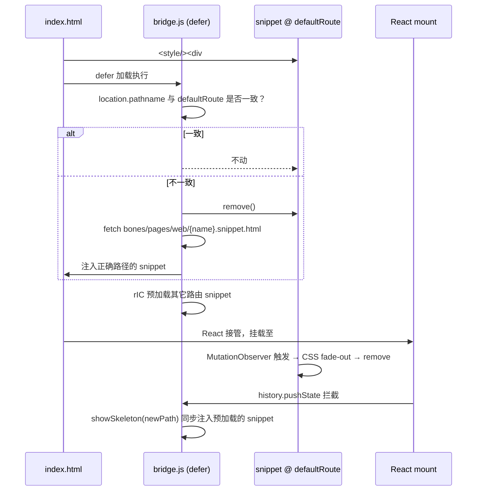

# 12 · Step 3 · SPA 路由 bridge（纯前端，无中间件）

> A 路径是单 `index.html`，但 SPA 有 N 条路由——bridge 负责在 boot 时和路由切换时**换骨架**。
> 全前端、零依赖，gzip ≤ 2 KB；不依赖任何 SSR 中间件。

---

## 1. 目标

1. **boot 时按真实路径换骨架**：`index.html` 注入的是 `defaultRoute` 的 snippet；若用户首次访问的是别的路径，bridge 在 React mount 前换成正确路径的 snippet
2. **SPA 路由切换换骨架**：`history.pushState` / `popstate` 时，给新路由展示对应骨架，直到组件 mount
3. **预加载**：`requestIdleCallback` 期间空载预加载所有路由的 snippet，路由切换时同步注入零延迟
4. **拆除**：复用 [10-step1 §3.1 IIFE 的 MutationObserver + MAX_WAIT 兜底](./10-step1-snippet生成器.md) 逻辑
5. **降级**：manifest 缺失 / 路径不匹配 / bridge 加载失败 → 退到无骨架，**不卡白屏**

---

## 2. 前置依赖

- [10-step1-snippet生成器.md](./10-step1-snippet生成器.md)：snippet 已生成
- [11-step2-vite-plugin-SSG-lite.md §3.4](./11-step2-vite-plugin-SSG-lite.md)：`manifest.json` 已产出在 `dist/bones/pages/web/`
- HTML 入口已注入 `<script src="/bones/pages/web/bridge.js" defer></script>`（由 Vite plugin 添加）

---

## 3. 关键设计

### 3.1 时序图



### 3.2 迷你路径匹配器（不引 path-to-regexp）

```js
var _reCache = {}
function compile(pattern) {
  if (_reCache[pattern]) return _reCache[pattern]
  var src = '^' + pattern
    .replace(/[.+?^${}()|[\]\\]/g, '\\$&')    // 转义元字符
    .replace(/\\\*/g, '.*')                    // * → .*
    .replace(/:([A-Za-z0-9_]+)/g, '[^/]+')     // :id → [^/]+
    + '/?$'
  return (_reCache[pattern] = new RegExp(src))
}
function matchRoute(pathname, routeMap) {
  for (var i = 0; i < routeMap.length; i++) {
    if (compile(routeMap[i].pattern).test(pathname)) return routeMap[i]
  }
  return null
}
```

### 3.3 连续快速导航保护

老 overlay 必须**先清理再注入新的**：

```js
function showSkeleton(pathname, manifest, cache) {
  var route = matchRoute(pathname, manifest.routes)
  if (!route || !cache[route.name]) return

  var old = document.getElementById("__skeleton")
  if (old) old.remove()
  var oldS = document.getElementById("__skeleton_s")
  if (oldS) oldS.remove()
  window.__SKELETON_READY__ = false   // 重置幂等标志

  /* 注入新 snippet：cached.html 仅含 div（无 script），dismiss 逻辑由本函数运行 */
  var styleEl = document.createElement('style')
  styleEl.id = '__bp_s'
  styleEl.textContent = cache[route.name].style
  document.head.appendChild(styleEl)

  var tmp = document.createElement('div')
  tmp.innerHTML = cache[route.name].html    // div#__skeleton 仅 div，无 script，innerHTML 安全
  var overlay = tmp.firstElementChild
  document.body.appendChild(overlay)

  attachObserver(overlay, styleEl, route.rootSelector, manifest.maxWait || 5000)
}
```

`attachObserver` 内含 MutationObserver、CSS-only fade、MAX_WAIT 兜底，**与 snippet IIFE 同构**，但**不依赖 snippet 内的 script**（[ssr-injection-design.md 决议 Q1](../boneyard-main/packages/boneyard/src/ssr-injection-design.md) 已证：innerHTML 注入的 script 不执行）。

### 3.4 预加载策略

```js
var rIC = window.requestIdleCallback || function (cb) {
  var start = Date.now()
  return setTimeout(function () {
    cb({ didTimeout: false, timeRemaining: function () { return Math.max(0, 40 - (Date.now() - start)) } })
  }, 1)
}

function preloadAll(manifest, cache) {
  var names = Object.values(manifest.routes).map(function (r) { return r.snippet })
  names = Array.from(new Set(names))
  var i = 0
  function next(idle) {
    if (i >= names.length) return
    if (idle.didTimeout || idle.timeRemaining() > 5) {
      var name = names[i++]
      fetch('/bones/pages/web/' + name + '.snippet.html')
        .then(function (r) { return r.text() })
        .then(function (html) {
          var tmp = document.createElement('div')
          tmp.innerHTML = html
          cache[name] = {
            style: tmp.querySelector('style')?.textContent || '',
            html:  tmp.querySelector("#__skeleton")?.outerHTML  || '',
          }
        })
        .finally(function () { rIC(next, { timeout: 2000 }) })
    } else {
      rIC(next, { timeout: 2000 })
    }
  }
  rIC(next, { timeout: 2000 })
}
```

### 3.5 history 拦截

```js
var origPush = history.pushState
history.pushState = function () {
  origPush.apply(this, arguments)
  showSkeleton(location.pathname, manifest, cache)
}
window.addEventListener('popstate', function () {
  showSkeleton(location.pathname, manifest, cache)
})
```

### 3.6 与 React Router / Vue Router 的兼容性

- 库内部一定走 `history.pushState`（验证过 react-router-v6、vue-router 4），所以拦截 push/popstate 即可
- 仅 `<Link replace>` 走 `history.replaceState` → bridge 加监听：

```js
var origReplace = history.replaceState
history.replaceState = function () {
  origReplace.apply(this, arguments)
  showSkeleton(location.pathname, manifest, cache)
}
```

---

## 4. 代码骨架

完整 bridge（约 2 KB gzip）：

```js
// packages/smarty/src/web/bridge.ts  → 编译为 dist/bridge.js
(function () {
  var BASE = '/bones/pages/web/'
  var manifest = null
  var cache = {}
  var MAX_WAIT = 5000

  var rIC = window.requestIdleCallback || /* polyfill 见 §3.4 */

  function compile(p) { /* §3.2 */ }
  function matchRoute(p, routes) { /* §3.2 */ }
  function attachObserver(overlay, styleEl, rootSel, maxWait) { /* observer + fade + MAX_WAIT */ }
  function showSkeleton(pathname) { /* §3.3 */ }
  function preloadAll() { /* §3.4 */ }

  fetch(BASE + 'manifest.json')
    .then(function (r) { return r.json() })
    .then(function (m) {
      manifest = m
      MAX_WAIT = m.maxWait || 5000
      // boot 时校正
      var name = matchRoute(location.pathname, Object.entries(m.routes).map(function (e) {
        return { pattern: e[0], snippet: e[1].snippet, rootSelector: e[1].rootSelector }
      }))
      var injected = document.getElementById("__skeleton")
      if (injected && name && name.snippet !== m.defaultRoute) {
        // index.html 注入的是 defaultRoute 的 snippet，当前路径不一致 → 换
        injected.remove()
        document.getElementById("__skeleton_s")?.remove()
        window.__SKELETON_READY__ = false
        fetchAndInject(name)
      }
      preloadAll()
      patchHistory()
    })
    .catch(function () { /* 不阻塞业务 */ })

  function patchHistory() {
    var origPush = history.pushState
    history.pushState = function () { origPush.apply(this, arguments); showSkeleton(location.pathname) }
    var origRepl = history.replaceState
    history.replaceState = function () { origRepl.apply(this, arguments); showSkeleton(location.pathname) }
    window.addEventListener('popstate', function () { showSkeleton(location.pathname) })
  }
})()
```

### 4.1 注入 bridge `<script>`

Vite plugin（[11-step2 §4](./11-step2-vite-plugin-SSG-lite.md)）的 `transformIndexHtml` 在注入 snippet 后追加：

```html
<script src="/bones/pages/web/bridge.js" defer></script>
```

`defer` 保证 bridge 在 DOM 解析完成后、DOMContentLoaded 之前执行。

---

## 5. 文件改动清单

| 路径 | 操作 |
|---|---|
| `packages/smarty/src/web/bridge.ts` | 新增 |
| `packages/smarty/src/web/bridge.config.ts` | 新增（编译为单文件 IIFE） |
| `packages/smarty/src/web/route-match.ts` | 新增（与 Vite plugin 共享 compile/matchRoute） |
| `packages/smarty/src/web/vite-plugin.ts` | **修改**：build 后复制 `bridge.js` 到 `dist/bones/pages/web/` |
| `packages/smarty/scripts/build-bridge.ts` | 新增（esbuild 把 bridge.ts 编译为单文件 IIFE） |
| `packages/smarty/test/bridge.test.ts` | 新增（jsdom 模拟 history pushState） |

---

## 6. 验收

| 检查 | 方法 |
|---|---|
| `bridge.js` gzip 体积 ≤ 2 KB | size-limit |
| boot 时路径不匹配，0–50ms 内换 snippet | playwright |
| `history.pushState` 后 16ms 内骨架可见 | playwright |
| 连续 5 次快速 pushState 不堆叠 overlay（DOM 只有 1 个 `#__skeleton`） | playwright |
| manifest 404 时 bridge 静默不报错 | console no errors |
| `prefers-reduced-motion: reduce` 时 fade 立即完成（CSS animation 0s） | media-query test |
| Observer 仅元素节点触发（避免空 div） | unit test |
| MAX_WAIT 兜底：手动停止 React 挂载，5s 后骨架消失 | playwright |
| `<Link replace>` 触发 replaceState 也换骨架 | playwright |

---

## 7. 已知坑 & 测试用例

1. **MPA 不需要 bridge**：纯多页应用每次 hard navigation，浏览器自己换 HTML → bridge 不该被注入。Vite plugin 用 `config.routes` 长度判断：≤ 1 时不注入 bridge `<script>`
2. **iframe 嵌套**：bridge 跑在 top window；iframe 内不注入（[10 snippet IIFE 已用 `window.__SKELETON_READY__` 隔离]）
3. **hash router 兼容**：`location.pathname` 不含 hash，bridge 默认不监听 `hashchange`；如项目用 hash router，加 `config.hashRouter: true`：

```js
if (config.hashRouter) {
  window.addEventListener('hashchange', function () { showSkeleton(location.hash.slice(1)) })
}
```

4. **`replace` 与 `Link` 误判**：vue-router 3.5 之前会触发 popstate；3.5+ 走 replaceState；统一拦截已覆盖
5. **`manifest.json` cache**：bridge 不加 `cache-buster`，靠 Vite 的 `[hash]` 文件名 + `manifest.json` 顶层（每次构建覆盖）。客户端可在 fetch URL 加 `?v=` 但会拉低缓存命中，不推荐
6. **CSP** `script-src 'self'`：bridge 是外链 script，OK；snippet 内的 inline IIFE 需 `'unsafe-inline'`，业务方需配 nonce 时由 Vite plugin 注入 `nonce` 属性（待 P1 扩展）
