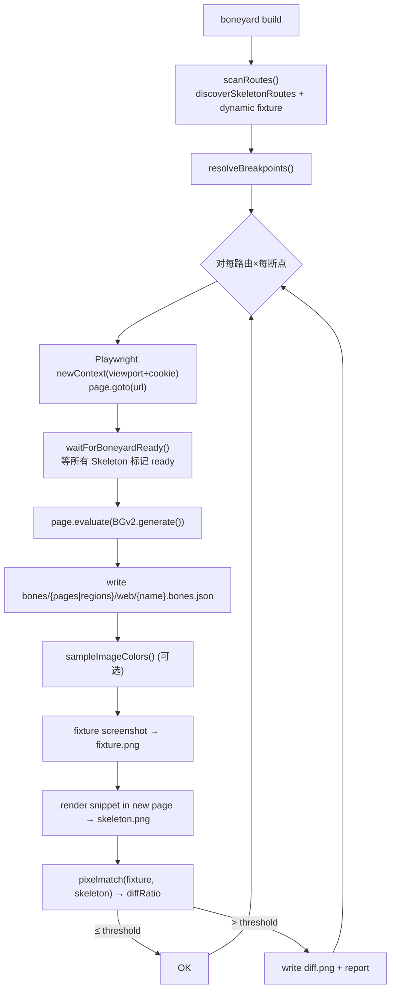

# 17 · Step 8 · Playwright 批量与 Visual Diff

> **唯一进 git 的权威捕获通路**（[00 §1 D4](./00-总览与决策锚点.md)）：用 Playwright 在所有断点跑一遍每个路由 / region，产出写入 `bones/`。
> `smarty check` 比对的是这份产物的 hash；[16 DevSave](./16-step7-DevSave-与dev-ske.md) 写到 `.smarty-cache/` 仅供人工预览，不参与。
> Visual Diff 是新增能力（11 个调研项目都没做），用 `pixelmatch` 算骨架与真实渲染的像素差异。

---

## 1. 目标

1. **批量采集**：所有路由 × 所有断点 × `<Skeleton>` 数量 → 自动产 `bones.json`
2. **登录态支持**：`--cookie` / `--storage-state` 注入 Playwright context
3. **动态路由 fixture**：`/user/[id]` 需要业务方在 `smarty.config.json` 提供示例 URL
4. **图片色采样**：构建期用 `sharp` 取真实 `` 主色，写入 `bones.json` `_sampled`
5. **Visual Diff**：对比 fixture 渲染截图 vs renderBones 出的骨架截图；像素差 > 5%（可配）→ CI fail
6. **diff 报告**：失败时产 `{name}@{w}.diff.png`，并输出 GitHub Actions annotation

---

## 2. 前置依赖

- [02 BGv2](./02-最佳生成算法.md)：算法可在浏览器侧运行
- [10-step1 snippet](./10-step1-snippet生成器.md)：可由 bones 产 HTML 截图
- [15-step6 断点扫描](./15-step6-断点自动扫描.md)：viewport 矩阵
- `playwright` `pixelmatch` `pngjs` `sharp` 已安装

---

## 3. 关键设计

### 3.1 流程图



### 3.2 CLI 入口

```ts
// packages/smarty/src/cli/build.ts
import { chromium, type Browser } from 'playwright'
import { writeFile } from 'node:fs/promises'

export async function build(opts: BuildOptions): Promise<BuildReport> {
  const config = resolveConfig(opts.cwd)
  const routes = await scanRoutes(opts.cwd, config)
  const breakpoints = resolveBreakpoints(
    await scan({ projectRoot: opts.cwd, config }),
    config.breakpoints,
  )

  const browser = await chromium.launch()
  const report: BuildReport = { ok: [], failed: [], visualDiff: [] }
  try {
    for (const route of routes) {
      for (const width of breakpoints) {
        const result = await captureRoute(browser, route, width, opts, config)
        report.ok.push(result.name)
        if (config.visualDiff?.enabled) {
          const diff = await runVisualDiff(result, width, config)
          report.visualDiff.push(diff)
          if (!diff.passed) report.failed.push(diff.name)
        }
      }
    }
  } finally {
    await browser.close()
  }
  return report
}
```

### 3.3 单个路由捕获

```ts
async function captureRoute(
  browser: Browser, route: RouteSpec, width: number, opts: BuildOptions, config: SkeletonConfig,
) {
  const context = await browser.newContext({
    viewport: { width, height: 720 },
    storageState: opts.storageState,
    extraHTTPHeaders: opts.headers,
  })
  if (opts.cookies) await context.addCookies(opts.cookies)
  const page = await context.newPage()

  await page.addInitScript({ path: require.resolve('smarty/dist/bgv2.iife.js') })
  await page.goto(route.url, { waitUntil: 'networkidle' })

  // 等待页面进入"已就绪"状态：window.__SK_READY__ 由业务在 useEffect 中设置 true
  await page.waitForFunction(() => (window as any).__SK_READY__ === true, { timeout: 30000 })
    .catch(() => { /* 超时则继续，BGv2 会按当前 DOM 采 */ })

  const dsl = await page.evaluate(() => (window as any).BGv2.generate())
  validate(dsl)

  if (config.generator.imageColorSample) {
    await sampleAllImages(dsl, route.url)             // sharp 采主色
  }

  const dir = resolve(opts.cwd, config.outDir.web, 'ssr')
  await writeFile(resolve(dir, `${route.name}.bones.json`), JSON.stringify(dsl, null, 2), 'utf8')

  const fixturePath = resolve(dir, `${route.name}@${width}.fixture.png`)
  await page.screenshot({ path: fixturePath, fullPage: false })

  await context.close()
  return { name: route.name, width, dsl, fixturePath }
}
```

### 3.4 图片色采样

```ts
// packages/smarty/src/cli/sample-image-color.ts
import sharp from 'sharp'

export async function sampleImageColor(absoluteUrl: string): Promise<string | null> {
  try {
    const buf = await fetch(absoluteUrl).then(r => r.arrayBuffer())
    const { dominant } = await sharp(Buffer.from(buf))
      .resize(8, 8, { fit: 'inside' })
      .stats()
    const { r, g, b } = dominant
    return '#' + [r, g, b].map(v => v.toString(16).padStart(2, '0')).join('')
  } catch {
    return null
  }
}

export async function sampleAllImages(dsl: SkeletonDSL, pageUrl: string): Promise<void> {
  const base = new URL(pageUrl)
  const queue = bonesOfType(dsl.bones, ['image', 'image-bg'])
  for (const bone of queue) {
    if (!bone.src) continue
    const abs = new URL(bone.src, base).href
    const color = await sampleImageColor(abs)
    if (color) { bone.sampledColor = color }
  }
}
```

### 3.5 Visual Diff

```ts
// packages/smarty/src/cli/visual-diff.ts
import { PNG } from 'pngjs'
import pixelmatch from 'pixelmatch'
import { readFile, writeFile } from 'node:fs/promises'
import { renderSnippet } from '../web/snippet'

export interface VisualDiffResult {
  name: string
  width: number
  passed: boolean
  diffRatio: number
  diffPath?: string
}

export async function runVisualDiff(
  capture: { name: string; dsl: SkeletonDSL; fixturePath: string },
  width: number,
  config: SkeletonConfig,
): Promise<VisualDiffResult> {
  // 1. 用 BGv2 输出渲染 skeleton.png（用 playwright 起一个空白页注入 snippet）
  const browser = await chromium.launch()
  const ctx = await browser.newContext({ viewport: { width, height: 720 } })
  const page = await ctx.newPage()
  const snippet = renderSnippet(capture.dsl, {
    rootSelector: '#__placeholder__',
    darkSelector: '.dark', maxWait: 99999,
  })
  await page.setContent(`<!DOCTYPE html><html><body>${snippet}<div id="__placeholder__"></div></body></html>`)
  await page.waitForTimeout(50)
  const skPath = capture.fixturePath.replace('.fixture.png', '.skeleton.png')
  await page.screenshot({ path: skPath })
  await browser.close()

  // 2. pixelmatch
  const fixturePng = PNG.sync.read(await readFile(capture.fixturePath))
  const skeletonPng = PNG.sync.read(await readFile(skPath))
  const { width: W, height: H } = fixturePng
  if (skeletonPng.width !== W || skeletonPng.height !== H) {
    return { name: capture.name, width, passed: false, diffRatio: 1, diffPath: undefined }
  }
  const diff = new PNG({ width: W, height: H })
  const numDiff = pixelmatch(fixturePng.data, skeletonPng.data, diff.data, W, H, { threshold: 0.1 })
  const ratio = numDiff / (W * H)
  const threshold = config.visualDiff?.threshold ?? 0.05

  if (ratio <= threshold) return { name: capture.name, width, passed: true, diffRatio: ratio }

  const diffPath = capture.fixturePath.replace('.fixture.png', '.diff.png')
  await writeFile(diffPath, PNG.sync.write(diff))
  return { name: capture.name, width, passed: false, diffRatio: ratio, diffPath }
}
```

`pixelmatch threshold: 0.1` 是**像素级**阈值，控制单像素颜色差异多大算"不同"；外层 `config.visualDiff.threshold = 0.05` 是**整图比例**阈值（百分比），控制 diff 像素占总像素多少算失败。

### 3.6 路由发现

```ts
// 复用 [skeleton-build-pipeline-design.md §7 discoverSkeletonRoutes]
// + dynamic route fixture
async function scanRoutes(root: string, config: SkeletonConfig): Promise<RouteSpec[]> {
  const files = await glob('src/**/*.{tsx,jsx,ts,js,vue,svelte}', { cwd: root })
  const found: RouteSpec[] = []
  for (const file of files) {
    const content = await readFile(resolve(root, file), 'utf8')
    if (!/<(Skeleton|Bound)\b/.test(content)) continue
    const skNames = [...content.matchAll(/<Skeleton\s+name=["']([^"']+)["']/g)].map(m => m[1])
    const route = fileToRoute(file, root, config)
    if (!route) continue
    const fixture = config.routes?.[route] ?? route                   // dynamic 用 config 提供
    for (const name of skNames) {
      found.push({ name, route, url: `${config.devServer ?? 'http://localhost:3000'}${fixture}` })
    }
  }
  return found
}
```

### 3.7 报告输出

```ts
// 控制台
console.log(`  ${ok}  ${stale}  ${visualDiff}`)
// CI 模式 --ci --json：标准 JSON 输出
{
  "ok": [{ "name": "home", "width": 1280 }],
  "visualDiff": [
    { "name": "home", "width": 375, "passed": false, "diffRatio": 0.082, "diffPath": "bones/pages/web/home@375.diff.png" }
  ],
  "exitCode": 1
}
```

GitHub Actions 集成（[19-step10](./19-step10-pre-commit-与-CI.md)）读取后输出 PR 注释 + 上传 diff.png 为 artifact。

---

## 4. 文件改动清单

| 路径 | 操作 |
|---|---|
| `packages/smarty/src/cli/build.ts` | 新增 |
| `packages/smarty/src/cli/scan-routes.ts` | 新增 |
| `packages/smarty/src/cli/sample-image-color.ts` | 新增 |
| `packages/smarty/src/cli/visual-diff.ts` | 新增 |
| `packages/smarty/bin/skeleton-v2.js` | 新增 / **修改**（注册 `build` 子命令） |
| `packages/smarty/dist/bgv2.iife.js` | 构建产物（rollup 打包 BGv2 为 UMD） |
| `packages/smarty/scripts/build-bgv2-iife.ts` | 新增 |
| `packages/smarty/test/visual-diff.test.ts` | 新增（用 fixture png + snapshot） |

依赖（新增）：`pixelmatch ^6` `pngjs ^7` `sharp ^0.34`（playwright 已有）

---

## 5. 验收

| 检查 | 方法 |
|---|---|
| `smarty build` 对 demo 项目跑通，所有断点 × 路由产出 `bones.json` | filesystem |
| `fixture.png` / `skeleton.png` 同尺寸 | image-size |
| 改 fixture 让骨架明显偏差 → `diff.png` 生成、`exitCode=1` | e2e |
| 改 fixture 微调（< 5%）→ passed: true，无 diff.png | e2e |
| `--storage-state auth.json` 登录态生效 | 演示页 |
| `/user/[id]` 用 `config.routes` 提供 fixture URL 访问成功 | e2e |
| `sharp` 采样图片色：fixture 含红色 banner → bone.sampledColor ≈ #ff0000 | e2e |
| `--ci --json` 输出格式可被 jq 解析 | shell |
| GitHub Actions diff.png 作为 artifact 上传 | CI |

---

## 6. 已知坑 & 测试用例

1. **`waitForFunction __SK_READY__`**：业务方要在主组件 `useEffect` 末尾 `window.__SK_READY__ = true`。文档/CLI 模板提供 codemod 一键插入；超时后兜底直接采，不阻塞 CI
2. **fixture screenshot 尺寸 vs viewport**：`fullPage: false` 只拍 viewport；如需 fullPage，配置项 `visualDiff.fullPage: true`，但 skeleton 需匹配同尺寸
3. **跨域图片 CORS**：`sharp` 用 Node fetch 取图，CDN 不需要 CORS；登录态内的图（cookies）需带 `headers`
4. **图片采样性能**：每张图一次 HTTP + sharp resize（~50–100ms），N=20 图 ~2s。可并行 5 路 `p-limit`
5. **Playwright headless 与真实 headed 渲染差异**：字体/抗锯齿可能略不同 → `pixelmatch threshold:0.1` 已容忍；如果差异大，降级到 `0.2`
6. **diff.png 体积**：大图可能 1–2 MB，CI artifact 累积 → 按 commit 短保留（GitHub 默认 90 天 → 7 天）
7. **Visual Diff 假阳性 / 假阴性**：第一次跑无 baseline 时 `passed=true`，仅当 diff > threshold 才失败；可加 `--update-snapshot` 强制重生 baseline
8. **headless Chrome 字体**：CI 容器需安装 `fonts-noto-cjk` 之类否则中文 fallback，diff 大；CI workflow 文档明示
