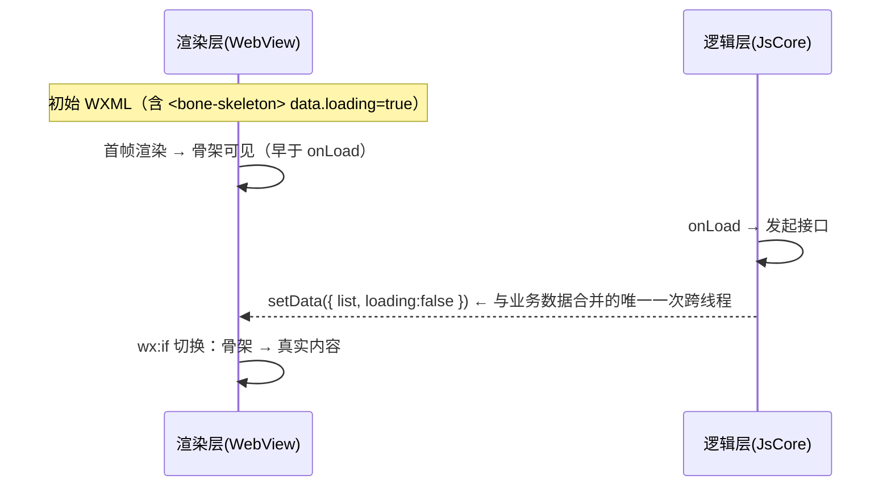

# 31 · Step 12 · Taro / 小程序后端

> 小程序双线程模型（渲染层 WebView + 逻辑层 JsCore）让骨架有独特优势：**在 `onLoad` 还没 `setData` 之前，渲染层就能把首帧 WXML 画出来**——这是小程序版的"SSR 等价物"，比 Web SSG-lite 更轻量。

---

## 1. 目标

1. **首帧骨架可见**：把骨架作为页面初始 WXML 的一部分（自定义组件 `<bone-skeleton>`），配合 `data.loading: true`，**首帧（逻辑层 `onLoad` 尚未 `setData`）就能显示骨架**
2. **零 setData 拆除**：拆除信号仅靠**业务首次 `setData({loading:false})`**，与业务数据合并为同一次跨线程通信，无额外开销
3. **Taro 一份代码三端**：同源代码（含 `<Skeleton>` / `<Bound>`）经 Taro 编译同时输出 H5 / 小程序 / RN
4. **多平台**：微信 / 支付宝 / 字节小程序 → 编译期适配
5. **dev:ske via Taro H5 预览态**：业务方在 Taro H5 模式 dev:ske 浏览 → 复用 [16 DevSave](./16-step7-DevSave-与dev-ske.md) 端点 + BGv2

---

## 2. 前置依赖

- [02 BGv2](./02-最佳生成算法.md)：Taro H5 模式下可用
- [16-step7 DevSave](./16-step7-DevSave-与dev-ske.md)：dev:ske 端点
- Taro v3+

---

## 3. 关键设计

### 3.1 时序图



### 3.2 自定义组件 `<bone-skeleton>`

```jsx
// packages/smarty/src/mp/mp-bone.tsx（Taro JSX）
import { View } from '@tarojs/components'
import { useDynamicBones } from './use-dynamic-bones'

export interface BoneSkeletonProps {
  name: string
  loading: boolean
  initialBones?: SkeletonDSL
}

export function BoneSkeleton({ name, loading, initialBones }: BoneSkeletonProps) {
  const dsl = initialBones ?? useDynamicBones(name)
  if (!loading) return null
  return (
    <View className="sk-root" style={{ position: 'relative', width: '100%', height: dsl.height + 'px' }}>
      {dsl.bones.map(b => (
        <View key={b.id} className="sk-bone"
          style={{
            position: 'absolute',
            left: b.x + '%', top: b.y + 'px',
            width: b.w + '%', height: b.h + 'px',
            borderRadius: b.r, backgroundColor: b.color
          }}
        />
      ))}
    </View>
  )
}
```

`initialBones` 由 Taro 编译期注入（同 [13-step4 SWC 注入](./13-step4-SWC-runtime-inject.md)，只是 transformer 是 Taro 插件版）。

### 3.3 Taro 编译期插件：WXML 预置

`@boneyard/taro-plugin` 在编译期：

1. 扫描 `pages/**/*.tsx` 中的 `<Skeleton name="x">`
2. 读取 `bones/mp/x.bones.json`
3. 把骨架渲染输出为 WXML 片段写入 `pages/{page}.wxml.partial`
4. 修改页面 wxml 头部，include 该 partial（小程序 `<include src="..."/>` 编译期内联）
5. 修改页面 data：注入 `loading: true`

```ts
// packages/smarty/src/mp/taro-plugin.ts
import type { IPluginContext } from '@tarojs/service'

export default (ctx: IPluginContext) => {
  ctx.onBuildStart(async () => {
    const pages = ctx.helper.findPages('src/pages')
    for (const page of pages) {
      const skeletons = extractSkeletons(page.file)
      for (const sk of skeletons) {
        const dsl = loadBones(`bones/mp/${sk.name}.bones.json`)
        const wxml = bonesToWxml(dsl, sk.name)
        writePartial(`dist/pages/${page.name}.wxml.partial`, wxml)
      }
      injectIntoPageWxml(`dist/pages/${page.name}.wxml`, page)
      injectLoadingTrueIntoData(`dist/pages/${page.name}.js`, page)
    }
  })
}
```

`bonesToWxml`：

```ts
function bonesToWxml(dsl: SkeletonDSL, name: string): string {
  return `<view wx:if="{{loading}}" class="sk-root" style="position:relative;width:100%;height:${dsl.height}px">
${dsl.bones.map(b =>
  `  <view class="sk-bone" style="position:absolute;left:${b.x}%;top:${b.y}px;width:${b.w}%;height:${b.h}px;border-radius:${b.r ?? 0};background-color:${b.color ?? dsl.rootColor}"></view>`
).join('\n')}
</view>`
}
```

### 3.4 拆除：与业务 `setData` 合并

业务方在请求成功后只需一次 `setData`：

```js
// pages/home/index.js
Page({
  data: { loading: true, list: [] },
  onLoad() {
    fetchList().then(list => this.setData({ list, loading: false }))
  }
})
```

`wx:if="{{loading}}"` 自动切换 → 骨架消失，业务渲染。**整个生命周期只有 1 次跨线程 setData**（铁律一在小程序的落点）。

### 3.5 动画：CSS @keyframes 跑渲染层

```wxss
/* pages/{page}.wxss */
.sk-bone { animation: __sk_p 1.8s ease-in-out infinite; }
@keyframes __sk_p { 0%, 100% { opacity: .85 } 50% { opacity: .45 } }
```

渲染层 WebView 原生支持 CSS 动画，**不走 setData 帧动画**（小程序性能杀手）。

### 3.6 断点（v2 经验值）

小程序 v2 默认断点改为经验值 **`[375, 414]`**：

| 断点 | 对应设备 |
|---|---|
| 375 | iPhone 6/7/8/X/11/12/13/14/15（标准款） |
| 414 | iPhone 6/7/8 Plus、XR、XS Max、11 Pro Max（大屏） |

理由：
- 小程序无 CSS @media 可扫，沿用 Web 的 `[375, 768, 1280]` 会浪费 1280 断点的采集时间
- iPad 上微信小程序极少（且自动按 414 兼容）
- `rpx` 单位（750 设计稿）由小程序运行时自动按设备宽度等比缩放，骨架尺寸不需额外处理
- 业务方有特殊设备需求时，在 [smarty.config.json `breakpoints.mp.extend`](./01-架构与模型.md) 加（例如 360 适配低端安卓）

### 3.7 dev:ske 通路：Taro H5 模式

```bash
# 业务方
pnpm taro build --type h5 --watch --env BONEYARD_SKE=1
```

Taro H5 模式跑的就是浏览器，复用 [16 DevSave](./16-step7-DevSave-与dev-ske.md) 的端点（Webpack devServer 注入）+ BGv2。捕获的 `bones.json` 写到 `bones/pages/mp/`（不是 `bones/pages/web/`），由 Taro plugin 编译期消费。

### 3.8 多平台编译目标

| 目标 | Taro CLI | 备注 |
|---|---|---|
| 微信小程序 | `taro build --type weapp` | `<include>` 原生支持 |
| 支付宝小程序 | `taro build --type alipay` | `<import>` + `<template>` |
| 字节小程序 | `taro build --type tt` | 同微信 |
| QQ 小程序 | `taro build --type qq` | 同微信 |
| 京东小程序 | `taro build --type jd` | 兼容 |
| H5 | `taro build --type h5` | 复用 Web 路径 |
| RN | `taro build --type rn` | 复用 [30](./30-step11-RN-后端.md) |

`bonesToWxml` 内部对 alipay 输出 `<template>`，对 weapp 输出 `<include>`，由 `--type` 决定。

### 3.9 异步页面的降级

`data.initial` 不能全部静态确定的页面（依赖 storage/异步参数）→ 退化为"逻辑层 ready 后才显示骨架"：

```js
Page({
  data: { loading: false, ready: false },
  async onLoad() {
    const params = await getStorage('userType')
    this.setData({ loading: true, ready: true, /* 决定哪个 skeleton */ })
    fetchByUserType(params).then(d => this.setData({ d, loading: false }))
  }
})
```

`wx:if="{{ready && loading}}"`，代价是首帧无骨架（[skeleton-architecture-design.md §5.3 决议](../boneyard-main/packages/boneyard/src/skeleton-architecture-design.md)）。

---

## 4. 文件改动清单

| 路径 | 操作 |
|---|---|
| `packages/smarty/src/mp/mp-bone.tsx` | 新增（Taro 自定义组件） |
| `packages/smarty/src/mp/taro-plugin.ts` | 新增（编译期 WXML 注入） |
| `packages/smarty/src/mp/bones-to-wxml.ts` | 新增 |
| `packages/smarty/src/mp/inject-page-data.ts` | 新增（在编译产物的 page.js 中注入 loading:true） |
| `packages/smarty/src/mp/use-dynamic-bones.ts` | 新增（运行时 fallback） |
| `apps/demo-taro/config/index.ts` | **修改**：plugins: ['smarty/mp/taro-plugin'] |
| `packages/smarty/test/mp/*.test.ts` | 新增 |

---

## 5. 验收

| 检查 | 方法 |
|---|---|
| 微信开发者工具加载页面 → 首帧（onLoad 前）骨架可见 | DevTools timeline |
| `setData({loading:false})` 后骨架消失，DOM 无残留 | DevTools elements |
| Taro `--type weapp/alipay/tt` 均生成对应 WXML/AXML/TTML | filesystem diff |
| dev:ske Taro H5 浏览 → `bones/mp/home.bones.json` 出现 | filesystem |
| CSS @keyframes 在 WebView 跑动画，无 setData 帧动画 | profiler |
| 异步页面 fallback：`wx:if="{{ready && loading}}"` 正确切换 | DevTools |
| 首帧骨架可见时刻（FCP-mp 等价指标）≤ 100ms | weapp performance trace |

---

## 6. 已知坑 & 测试用例

1. **小程序自定义组件限制**：单个 page 内 `<bone-skeleton>` 实例 ≤ 1（小程序对自定义组件实例数有上限，且编译期注入更高效）
2. **`<include>` 不支持动态路径**：必须编译期决定；Taro plugin 已处理
3. **Alipay 小程序 `<include>` 语义不同**：要用 `<import>` + `<template>` 组合；本设计已分支
4. **wxss px 转 rpx**：小程序原生用 rpx；本设计直接用 px，由小程序自动按设备适配（也可在 Taro 配置 `designWidth: 750` 自动转换）
5. **图片采样**：小程序无法跑 sharp，所有图片采样在 Taro H5 dev:ske 阶段完成，bones.json 写入 `sampledColor`，运行时直接用
6. **真机预览体验**：开发者工具的 timeline 可能与真机有差异，**必须真机测一次**
7. **多 Tab 页**：每个 Tab 是一个 page；每个 page 独立 `<bone-skeleton name="...">`
8. **小程序新版本编译器**：微信 2.x 编译器调整 wxml 处理顺序——Taro plugin 在 `onCompilerEnd` 阶段注入，不依赖具体编译器版本
9. **`setData` payload 过大**：list 数据若与 loading:false 同 setData，跨线程时间增加；可选 `loading:false` 单独 setData，再 setData list（代价：拆除晚 ~16ms）
