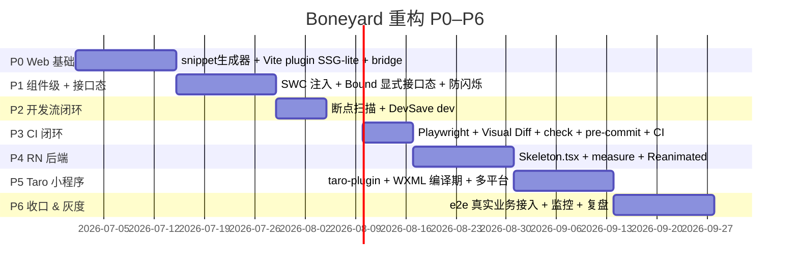

# 41 · Rollout 里程碑与回滚

> 分期落地计划，含每期范围、验收、灰度策略、回滚预案。
> 默认节奏按 [README §7](./README.md) 给出的"Week 1–7+"。

---

## 1. 里程碑总览



---

## 2. 各阶段范围 / 验收 / 风险

### P0 · Web 基础（2 周）

**范围**：BGv2 算法 + snippet + Vite plugin SSG-lite + SPA bridge

**实施步骤**：

1. [02 §1–§14](./02-最佳生成算法.md) BGv2 10 阶段全部实现，能在浏览器侧跑通
2. [10-step1](./10-step1-snippet生成器.md) renderSnippet() + 模板变量
3. [11-step2](./11-step2-vite-plugin-SSG-lite.md) Vite plugin + transformIndexHtml
4. [12-step3](./12-step3-SPA-router-bridge.md) bridge.js（IIFE 单文件）

**验收**：在内部 demo 项目（`apps/demo`）跑通：

- `smarty build` 产出 `bones/pages/web/home.bones.json` + `home.snippet.html` + `manifest.json`
- `vite build` 后 `dist/index.html` 含 snippet，访问首屏 0.6s 内骨架可见（Fast 3G）
- 路由切换骨架同步换

**风险 & 回滚**：

- BGv2 算法在复杂页面（CSS Grid + 第三方组件）准度不足 → 降级到现有 boneyard-js 1.8.1，先用旧算法跑通管道
- snippet HTML 体积 > 6 KB → 检查 styleCache 是否真正去重；css-tree 裁剪是否生效
- bridge 与 React Router 不兼容 → bridge 增加配置 `routerType: 'react-router'|'vue-router'|'manual'`

### P1 · 组件级 + 接口态（2 周）

**范围**：[13-step4](./13-step4-SWC-runtime-inject.md) SWC 注入 + [14-step5](./14-step5-Bound显式接口态.md) Bound 显式接口态 + 防闪烁

**验收**：

- `<Skeleton name="x">` 编译后自动有 `initialBones`，未引用的不打进 chunk
- `<Bound deps>` 多 region 各自切换；防闪烁 delay/minDuration 生效
- React Query / SWR / fetch 三个适配器跑通

**风险 & 回滚**：

- SWC plugin 与业务自有 SWC plugin 冲突 → 提供 babel 等价版本
- Bound 包裹引入额外 div 破坏样式 → 提供 `<Bound as="span" />` 自定义标签
- 适配器在业务 monkey-patch 后失效 → 兜底 `dataRegistry.setStatus` 手动 API

### P2 · 开发流闭环（1 周）

**范围**：[15-step6 断点扫描](./15-step6-断点自动扫描.md) + [16-step7 DevSave](./16-step7-DevSave-与dev-ske.md)

**验收**：

- `dev:ske` 浏览页面自动写 bones，HMR 200ms 内热更新
- 断点扫描覆盖 CSS @media + Tailwind + 运行时 styleSheets
- 普通 `dev` 模式 HMR 速度无回退

**风险 & 回滚**：

- DevSave 写盘失败（权限） → 端点返回 400，前端控制台 warn，不影响业务
- 断点扫描扫到几十个噪声值 → mergeGap 调到 32 px，或显式 `autoScan: false`

### P3 · CI 闭环（1 周）

**范围**：[17-step8 Playwright + Visual Diff](./17-step8-Playwright批量与Visual-Diff.md) + [18-step9 check](./18-step9-check-CLI-深层依赖.md) + [19-step10 pre-commit + CI](./19-step10-pre-commit-与-CI.md)

**验收**：

- `smarty check --ci --json` 输出格式正确，能被 GitHub Actions 消费
- pre-commit 阻断不同步
- PR 注释含 MISSING / STALE / DRIFT
- Visual Diff 失败时上传 diff.png 为 artifact

**风险 & 回滚**：

- Playwright 在 CI 容器跑得不稳定 → 改 `vite preview` 替代 dev server
- Visual Diff 假阳性多 → 阈值从 5% 升到 10%；font fallback 导致差异 → 容器安装中文字体
- check 把 design-tokens 算进 hash 误报 → 加进 ignoreGlobs

### P4 · RN 后端（2 周）

**范围**：[30-step11](./30-step11-RN-后端.md)

**验收**：

- iOS / Android 模拟器内 `<Skeleton>` 工作；shimmer 在 JS 长任务期间不掉帧
- dev:ske via Metro 浏览写入 `bones/pages/rn/`
- 无 Reanimated 环境降级静态骨架不崩

**风险 & 回滚**：

- measure 收集慢 → 用 `unstable_batchedUpdates`；超时退化 fixture 模式
- Hermes/Fabric 兼容问题 → 实际验证一遍真机
- Expo Go 无 Reanimated → 文档明示用 Expo Dev Client

### P5 · Taro 小程序（2 周）

**范围**：[31-step12](./31-step12-Taro-小程序后端.md)

**验收**：

- 微信小程序首帧骨架可见（onLoad 前）
- `--type weapp/alipay/tt` 三平台产出对应 WXML/AXML/TTML
- dev:ske 在 Taro H5 模式工作

**风险 & 回滚**：

- 小程序自定义组件实例数限制 → 编译期注入而非运行时
- alipay 编译差异大 → 单独维护 alipay 适配器
- 真机性能差 → CSS @keyframes 跑 WebView 兜底，避免 setData 动画

### P6 · 收口 & 灰度（2 周）

**范围**：业务真实接入 + 监控 + 复盘

**实施步骤**：

1. 挑选 1 个 Web 业务（中等复杂度，5–10 个路由）灰度 10% 流量
2. 部署 RUM 监控：FP / CLS / TBT / Visual Diff 命中率 / pre-commit 阻断率
3. 灰度 1 周后扩到 50%；2 周扩到 100%
4. 复盘：性能基线达成？误报率？开发者满意度？

**回滚预案**：

- 灰度期间 Web Vitals 任一指标显著恶化 → 关闭中间件（环境变量 `SKELETON_SSG=0`）即可，零代码改动
- check pre-commit 阻断率 > 30%（开发者抱怨）→ ignoreGlobs 扩大；或临时把 check 降级为 warn-only
- Visual Diff 假阳性 > 20% → 阈值调高 / 关闭

---

## 3. 灰度策略

### 3.1 Web SSG-lite 灰度

```html
<!-- index.html 注入时根据 cookie 决定是否启用 -->
<script>
  if (document.cookie.includes('skeleton-v2=1')) {
    /* snippet 注入 */
  }
</script>
```

更稳健：用 nginx / CDN 边缘 cookie 路由到不同 dist 版本：

- `dist-v2/index.html`（含 snippet）→ 灰度用户
- `dist-v1/index.html`（无 snippet）→ 其它

### 3.2 接口态 `<Bound>` 灰度

`Bound` 内部读 feature flag：

```tsx
import { Bound, useFeatureFlag } from 'smarty/react'

const isOn = useFeatureFlag('skeleton-bound')   // 业务方注入
return isOn
  ? <Bound id="x" deps={[...]}>...</Bound>
  : <>{children}</>
```

### 3.3 三端独立灰度

Web / RN / Taro 可独立灰度；推荐先 Web → RN → Taro 顺序（按 [P0–P5 完成度](./README.md)）。

---

## 4. 监控指标

### 4.1 性能指标（Web）

| 指标 | 工具 | 目标 |
|---|---|---|
| FP（First Paint） | `performance.getEntriesByType('paint')` | 灰度组 vs 对照组 ≥ -200ms |
| FCP | 同上 | 不回退 |
| LCP | PerformanceObserver | 持平（设计预期，[skeleton-architecture-design.md §6.2](../boneyard-main/packages/boneyard/src/skeleton-architecture-design.md)） |
| CLS | layout-shift entries | 改善（撑开 root） |
| TBT | longtask entries > 50ms | ≤ 对照组 |
| Speed Index | Lighthouse | 灰度组改善 |

### 4.2 健康指标

| 指标 | 工具 | 目标 |
|---|---|---|
| `MAX_WAIT` 兜底命中率 | 自带埋点（`teardownReason=timeout`） | < 1% |
| LCP 污染率（LCP 元素是骨架节点） | PerformanceObserver `largest-contentful-paint` 的 `element` | 0% |
| pre-commit 阻断率 | git server log | 持平历史，无骤升 |
| CI 时间 | GitHub Actions | check < 10s，build full < 5min |
| Visual Diff 失败率 | CI artifact 计数 | < 5%（设计阈值内） |

### 4.3 RUM 埋点（Idle 上报，零性能影响）

```ts
window.addEventListener('boneyard:teardown', (e) => {
  requestIdleCallback(() => {
    navigator.sendBeacon('/rum/boneyard', JSON.stringify({
      name: e.detail.name, mode: e.detail.mode,
      shownAt: e.detail.shownAt, dismissedAt: e.detail.dismissedAt,
      teardownReason: e.detail.reason,             // 'mutation' | 'data' | 'timeout'
      maxWaitHit: e.detail.maxWaitHit,
      lcpPolluted: checkLcpPolluted(),
    }))
  })
})
```

---

## 5. 复盘模板

每个里程碑结束后写一篇复盘（落到 `docs/retrospective/` 或 wiki）：

```md
# 骨架重构 Pn 复盘

## 数据
- 灰度范围：____
- 流量量级：____
- 持续时间：____

## 性能对比
| 指标 | 对照 | 实验 | 差异 |
| --- | --- | --- | --- |
| FP  |     |      |     |
| CLS |     |      |     |
| TBT |     |      |     |

## 踩坑
- 坑 1：____ 修复：____
- 坑 2：____ 修复：____

## 决策回顾
- [00 §1 D1](./00-总览与决策锚点.md) 是否仍合理？____
- 哪些 [42 Open Questions](./42-Open-Questions-后置.md) 应该上提为必做？____

## 下一步
- ____
```

---

## 6. 退出条件（项目何时算"做完"）

满足以下**全部**条件方可宣布完成：

1. [40 验收清单 G1–G8](./40-验收清单-G1-G8.md) 8 个目标全部 ✓
2. 至少 1 个 Web + 1 个 RN（或 1 个 Taro）业务全量上线（100% 灰度）
3. RUM 指标 30 天稳定：FP 改善、LCP 不回退、TBT 不回退、Visual Diff 失败率 < 5%
4. 开发者满意度调研：≥ 80% 认可
5. 文档与代码 1:1 同步（CI lint 检查）
